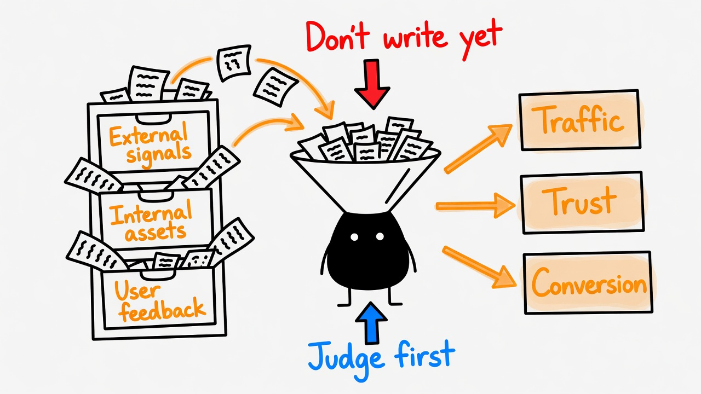
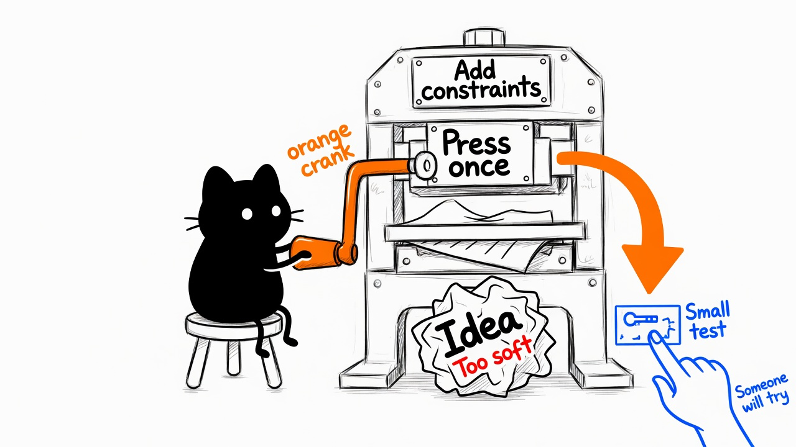
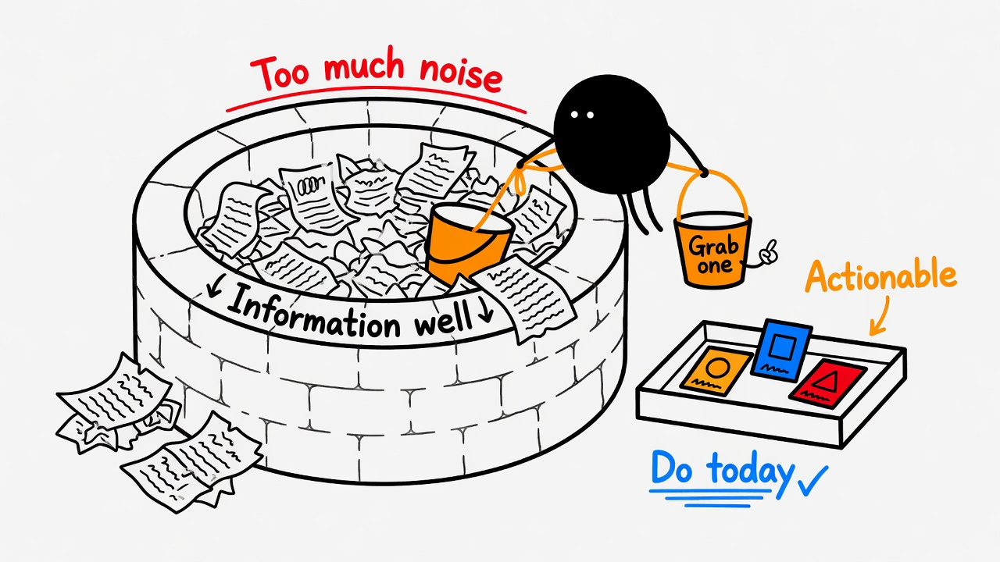
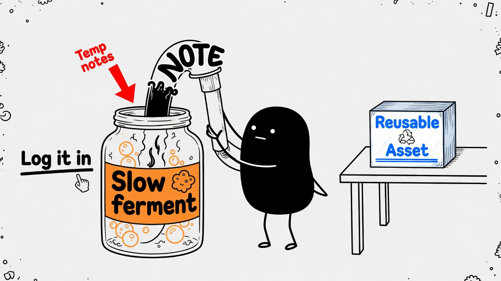

# Explainer Illustrations

> Turn an article's judgments, processes, states, and metaphors into white-background, hand-drawn, whimsical-but-clean body illustrations.
>
> 16:9 landscape | Inky mascot IP | pure-white hand-drawn | sparse red/orange/blue English annotations | Agent Skill

---

## What this repo is

Explainer Illustrations is an agent skill that guides AI agents to generate body illustrations for articles, posts, blogs, Notion docs, and methodology content.

It is not a generic illustration prompt pack or a PPT infographic template. The core goal is to find cognitive anchors in the article first, then turn one judgment, process, structure, state, or metaphor into a memorable 16:9 hand-drawn explanation image.

The default visual IP is **Inky** (English name for the black ink creature; legacy alias: Xiaohei / 小黑): a solid-black creature with white dot eyes, thin legs, and a blank expression. Inky is not a mascot sticker or corner decoration — Inky is an absurd worker earnestly participating in the system on screen.

In one line: **don't just "add an image" — draw one key cognitive action from the article.**

---

## Who it's for

Good fit:

- Writers who need body illustrations and inline article images
- Knowledge content, methodology content, AI workflow content
- Anyone who wants abstract judgments turned into concrete metaphors
- Anyone who wants something lighter and weirder than PPT infographics, with a recognizable visual language
- Agent-assisted content production with a stable visual system

Not a fit:

- Commercial illustration, brand KV, or polished flat illustration
- Traditional PPT infographics, complex architecture diagrams, or formal flowcharts
- Cute cartoon, children's IP, or sticker-pack style
- Packing long body text or full course pages into one image
- Strictly editable vector source files

---

## What it produces

Default outputs:

- 16:9 landscape body illustrations
- A 4–8 image shot list per article
- Per-image topic, core meaning, structure type, Inky action, and suggested English labels
- Final PNG files saved to `assets/<article-slug>-illustrations/` in the workspace

Default non-outputs:

- PPTX / PDF / Keynote
- SVG / HTML / Canvas editable diagrams (unless using the code backend intentionally)
- Commercial posters or cover KV
- Dense text-heavy infographics

---

## Image generation via harness workers

The orchestrating agent **does not** call image tools directly. It delegates to harness workers through the **bundled use-harness** skill at `use-harness/` in this repo:

| Backend | Harness worker | Worker uses |
|---------|----------------|-------------|
| **`grok-imagine`** | `grok` (Grok Build) | `image_gen` / `image_edit` |
| **`gemini-nano-banana`** | `agy` (Antigravity) | `agy -p` + Gemini image model |
| **`codex-imagine`** | `codex` | built-in `image_gen` (GPT Image 2) |
| **`code`** | `claude` (or `codex` for SVG only) | SVG/HTML → PNG — no image model |

Pick a backend by telling the agent, or set `EXPLAINER_IMAGE_BACKEND`.

```bash
SKILL_DIR="${USE_HARNESS_SKILL_DIR:-$(./scripts/harness-dir.sh)}"
node "$SKILL_DIR/scripts/run-harness.mjs" \
  --harness grok --task implement \
  --prompt "Generate one 16:9 Inky illustration…" \
  --cwd . --json
```

Use `--task implement` (not `--task image` — rejected by the router). See [harness-delegation.md](ian-xiaohei-illustrations/references/harness-delegation.md) and [image-gen-backends.md](ian-xiaohei-illustrations/references/image-gen-backends.md).

---

## Visual style

Default style: Ian's "Inky whimsical body illustration" look:

- Pure white background — no paper texture, beige, shadows, or gradients
- Black hand-drawn line art — thin lines, slight wobble
- Lots of whitespace — subject occupies ~40%–60% of the frame
- Sparse red, orange, and blue **English** hand-written annotations
- One core action, structure, state, or metaphor per image
- Inky must participate in the core action, not just decorate
- Whimsical, creative, clean — not childish or cute

---

## Example output

### Two breakpoints


### Sort by purpose



### One fish, many uses


### Handoff path



### Information well



### Idea press


### Content fermentation



### Trust bridge


These images are English style calibration samples (Inky whimsical body illustrations), not composition templates. Invent fresh metaphors from the current article — do not copy old cases.

---

## Install

This repo is self-contained: `use-harness` is bundled at `use-harness/` — no external skill install required.

```bash
git clone https://github.com/manikanda-kumar/explainer-illustrations.git
cd explainer-illustrations
```

Verify harness CLIs (you need at least one of `grok`, `agy`, `claude`, or `codex` on PATH):

```bash
node ./use-harness/scripts/run-harness.mjs doctor --json
```

Copy both skills into your agent skills directory:

```bash
# Codex
mkdir -p "${CODEX_HOME:-$HOME/.codex}/skills"
cp -R ./ian-xiaohei-illustrations "${CODEX_HOME:-$HOME/.codex}/skills/"
cp -R ./use-harness "${CODEX_HOME:-$HOME/.codex}/skills/"

# Claude Code
mkdir -p "$HOME/.claude/skills"
cp -R ./ian-xiaohei-illustrations "$HOME/.claude/skills/"
cp -R ./use-harness "$HOME/.claude/skills/"
```

When working from a clone, resolve the router automatically:

```bash
SKILL_DIR="$(./scripts/harness-dir.sh)"
```

Optional environment:

```bash
export EXPLAINER_IMAGE_BACKEND=grok-imagine   # or gemini-nano-banana, codex-imagine, code
export EXPLAINER_CODE_HARNESS=claude          # when backend=code: claude (default) or codex (SVG only)
# Only if not using the bundled copy or scripts/harness-dir.sh:
# export USE_HARNESS_SKILL_DIR="/path/to/explainer-illustrations/use-harness"
```

Then invoke:

```text
Use $ian-xiaohei-illustrations to design and generate 5 whimsical Inky body illustrations for this article. English labels only. Use grok imagine.
```

---

## Usage

### Shot list only (no generation)

```text
Use $ian-xiaohei-illustrations — do not generate images yet.
Analyze where this article deserves illustrations and output a shot list of ~5 images.
For each image specify: paragraph placement, topic, core meaning, structure type,
what Inky is doing, suggested elements, and suggested English label words.

<paste article>
```

### Generate body illustrations

```text
Use $ian-xiaohei-illustrations to generate 4 whimsical Inky body illustrations for this article.
Requirements: 16:9 landscape, pure white background, black hand-drawn line art,
sparse red/orange/blue English hand-written annotations. Use gemini nano banana.

<paste article>
```

### Single concept, one image

```text
Use $ian-xiaohei-illustrations to generate one body illustration for:
"Trust isn't shouted — it's laid down one piece of evidence at a time."
Whimsical but clean. Inky must carry the core action. Use code imagegen.
```

### Edit: remove a title

```text
Use $ian-xiaohei-illustrations to edit this image.
Remove the "Flowchart" title in the top-left corner. Keep everything else unchanged.
```

More examples in [examples/prompts.md](examples/prompts.md).

---

## Workflow

1. Read the article, Markdown, Notion content, screenshot, or user-provided topic
2. Extract core argument, cognitive turns, process structure, and visually suitable paragraphs
3. Output a shot list first — one cognitive anchor per image
4. Pick a structure type: Workflow, system slice, before/after, role state, concept metaphor, method layers, map route, or mini-comic panels
5. Invent a low-tech, whimsical-but-coherent physical metaphor
6. Put Inky in the core action
7. Delegate each image to a harness worker via use-harness (see [harness-delegation.md](ian-xiaohei-illustrations/references/harness-delegation.md))
8. QA per checklist: white background, whitespace, Inky action, English labels, no PPT feel, no old-case copy
9. Save final PNGs and report usage and paths

---

## Directory structure

```text
.
├── README.md
├── LICENSE
├── NOTICE.md
├── scripts/
│   └── harness-dir.sh
├── use-harness/              # bundled harness router (Codex / Grok / Agy)
│   ├── SKILL.md
│   ├── scripts/
│   └── references/
├── assets/
│   └── ian-wechat-qr.jpg
├── examples/
│   ├── images/
│   │   ├── 01-two-breakpoints.png
│   │   ├── 02-sort-by-purpose.png
│   │   └── ...
│   └── prompts.md
└── ian-xiaohei-illustrations/
    ├── SKILL.md
    ├── agents/
    │   └── openai.yaml
    ├── assets/
    │   └── examples/
    └── references/
        ├── style-dna.md
        ├── inky-ip.md
        ├── composition-patterns.md
        ├── prompt-template.md
        ├── image-gen-backends.md
        ├── harness-delegation.md
        └── qa-checklist.md
```

Install `ian-xiaohei-illustrations/` and `use-harness/` into your agent skills folder (or work from a full clone and use `scripts/harness-dir.sh`). The root README, LICENSE, NOTICE, and examples are GitHub sharing docs.

---

## Notes

- Shorter English labels inside images are more stable.
- One core structure per image — don't turn the article into a manual.
- Inky must carry the core action; if removing Inky leaves the image fully intact, Inky is too decorative.
- Example images calibrate line density, whitespace, color restraint, and Inky participation — don't copy compositions.
- AI image models may produce misspellings, hallucinated labels, style drift, or extra titles — check after generation.
- If label text is badly wrong, reduce label count and regenerate, or switch to the `code` backend.

---

## Related projects

- [Ian Handdrawn PPT](https://github.com/helloianneo/ian-handdrawn-ppt) — hand-drawn technical PPT-style page generation skill
- [Awesome Claude Code Skills](https://github.com/helloianneo/awesome-claude-code-skills) — curated Claude Code skills, agents, and plugins
- [Obsidian + Claude AI Second Brain](https://github.com/helloianneo/obsidian-ai-second-brain) — Obsidian + Claude personal knowledge base guide

---

## About the author

**Ian** — product designer / solo-builder practitioner / AI builder

Building a one-person company with an AI team.

- GitHub: [helloianneo](https://github.com/helloianneo)
- X/Twitter: [@ianneo_ai](https://x.com/ianneo_ai)
- Website: [www.ianneo.xyz](https://www.ianneo.xyz)
- WeChat: `ianneoxyz`
- Email: hello.neoc@gmail.com

---

## License

MIT License. See [LICENSE](LICENSE).